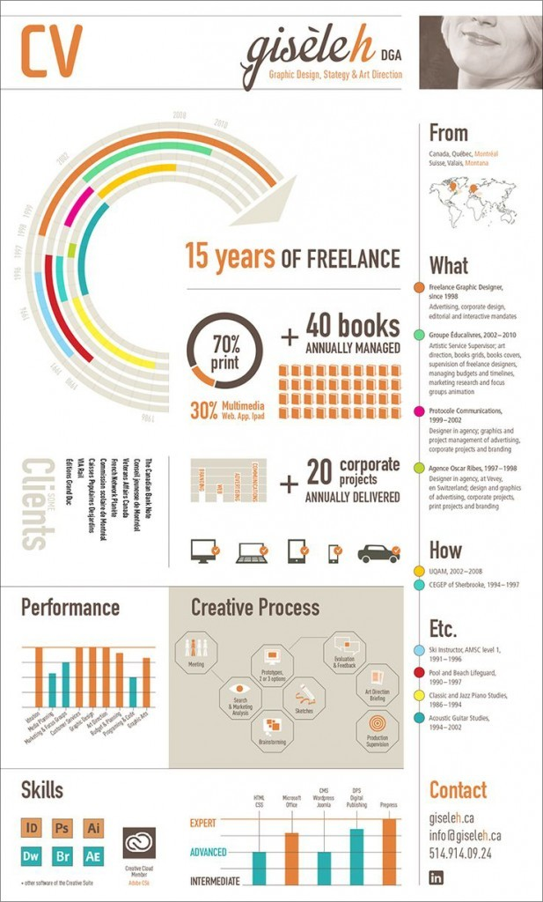
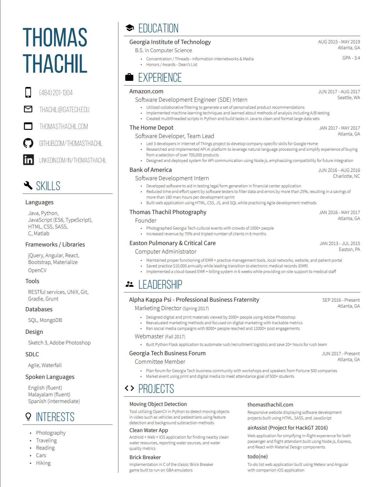

# Confidence & Mindset: **Dear freshmen, internships are not just for upperclassmen!**

Welcome to Georgia Tech’s campus. You may have already felt this at the beginning of the semester, but August and September is always crunch time for attending info sessions and career fairs. Students use these platforms as a way to find an internship or job.

As a senior at Georgia Tech and veteran myself, I have heard many concerns from freshmen in particular about pursuing internships. The most common ones echo the following:

* I’m a freshman. There’s so much time left. I don’t even know what I’m doing post-graduation. What would I even be doing with an internship.
* I’m a freshman, and have no experience. What’s the point when there are more qualified candidates?

I empathize with these sentiments and understand how intimidating it can be when your older friend has a beautiful and filled up resume while yours just has high school experience. However, using your doubts as a crutch will create a chicken-egg situation: you don’t have the experience to get an internship – you don’t have the internship to gain experience. Personally, I think the best thing to do for your career in college is to be proactive. Act and think later. Apply and think later. Attend those career sessions and think later.

Do things proactively, but not blindly. When you are speaking to company representatives, whether it be at the career fair or info sessions, the most effective way to present yourself is with intention. Employers love when a student can convey genuine interest for their companies. Even when you may not be the most technically qualified, that quality can take your candidacy a long way as knowing why you want to work for a company gives a longer lasting impression. So what is a way to research companies?

Georgia Tech’s [CareerBuzz website](https://gatech-csm.symplicity.com/students/?signin_tab=0) posts all of C2D2’s hosted info sessions and career fairs. Use the search filters to find companies that are open to hiring freshman candidates; filter to which industries you have general interest for; then research the companies’ own sites - I especially recommend pages like “Values” and “What We Do.”

Once you figure out which companies you are interested in, plan accordingly to fit career fair and info session dates onto your calendar. I recommend prioritizing which companies you are most interested in and know you have the greatest chance at. It is really easy to get overwhelmed trying to balance schoolwork and internship hunting, so a laser-focused priority list can alleviate that challenge.

[C2D2](https://career.gatech.edu/) often also hosts mock interviews and resume workshops for you to brush up on your content. I remember signing up for mock interviews myself as a freshman - they all went horribly, but the practice was very helpful in helping me improve my confidence. You can sign-up for these professional development workshops on the CareerBuzz website as well.

Lastly, to give you a better sense of the internship landscape, here are the kinds of companies that usually come to recruit at Georgia Tech’s biggest career fair, All-Majors Career Fair: https://career.gatech.edu/fall-2019-all-majors-career-fair.

Over 350 companies came to recruit us in Fall 2019, so don’t doubt yourself and think you have no shot!

# Resume

A **resume** is a document that lists your background, applicable skills, accomplishments, and any other pertinent information you would want your potential future employer to know. Other pertinent information could include things like

* Personal technical projects
* Any TA/tutoring positions you’ve held
* Leadership positions in student organizations
* Volunteer/social welfare contributions (Think Bits of Good or Girls who Code)

When describing these on your resume, be **specific** and **concise**. You should aim to get all the information you want on your resume on one page. Anything longer than that will lose a recruiter’s attention or get auto-filtered out on an online application page. Do **NOT** put anything on your resume that you would feel unconfident talking about to a recruiter or during an interview. This will make you look like you don’t actually know what’s on your resume! Remember, the resume is only one part of securing an internship and is how you get your foot in the door of an employer. There’s still the interview portion, which we will cover later in the guide.
When designing your resume, you want to keep in mind that recruiters will be looking at hundreds of resumes, whether at the career fair or after being filtered if applying online. How do you stand out against the competition? Keep your resume formatting slightly different from the norm, but not too flashy. Afterall, your employer is more interested in your skills and talents than how well you can position things on a document. There is a phenomenon called the **F-pattern reading** where people pay most attention when reading the first line of a paper, but as they continue to read, their attention gradually drops. Therefore, when deciding which sections should be higher up on your resume, put your most outstanding things that you want the recruiter to remember first then put your other sections. In every section, it is standard to list each subtopic chronologically, so it is easy for the recruiter to see growth.

#### Resume Example 1

#### Resume Example 2

Above are two examples of resumes. The one on the left is very flashy and more oriented for a design position. As you can see there are not a lot of specific descriptors of the work the person has accomplished. However, the resume on the right is perfect for a technical role. It is easy to follow, has specific descriptions for many of his points, has minimal colors, and all fits on one page. There are many free resume templates you can find online, but stick to templates that have similar qualities of the resume on the right.

At Tech, there are many resources that will help you hone your resume-making skills. Through C2D2, the CoC, and student orgs like Alpha Kappa Psi, you can attend resume workshops where experienced people can give you feedback on your resume.

# Career Fair - in progress

## Behavioral Interviews

Behavioral interviews evaluate your personality, communication skills, and how well you bring your resume to life. Luckily, they are pretty standard across the board, and you should always prepare your answers ahead of time because you can always expect these questions:

* Tell me about yourself
* Why do you want to work here?
* What is your favorite class in school?
* Tell me about this class you took/internship you had/project you undertook
* What interests you about (insert job type here)?
* Did you ever have a time when you disagreed with someone you were working with and how did you overcome that?
* Tell me about a time where you took on a leadership role
* What are your preferred programming languages and why?

While answering these questions, keep in mind that your interviewer is looking for how well you:

* Hold a conversation
  * Nervousness is understandable, but don't let it cripple the conversation. Feel free to pause before you answer to collect your thoughts. Be polite and genial even if the interview isn't going well.
* Know your resume
  * We all embellish a little bit on our resume. However, whatever you write is fair game for any questions about it. Err on the side of caution and don't put that you are "proficient in C++" when you've only done a beginner's tutorial, for example. The interviewer might be an expert in C++ and will know instantly if you're bluffing from just a few questions, which will lose you a lot of points. If you are asked a question that you aren't qualified to answer, don't pretend you know and try to make something up. Instead, admit that you're not sure, and give an educated guess.
* Communicate at a high level about what you accomplished.
  * When your interviewer asks you to explain what you did in a class/internship/project, keep it concise and use the STAR method: Situation, Task, Action, Result. Don't spend too much time talking about the situation--a few sentences will suffice. The interviewer is interested in what actions you took and the results, not a whole backstory. Really highlight your contributions and role by using active voice, and don't shy away from talking about the difficulties you faced (as long as you can explain how you overcame them).
* Can lead a team or take ownership of a project
  * This ties in with the previous point, but try to show that you can take initiative. Talk about an experience you had where you were responsible for a big part of the deliverables. Did you delegate any tasks to others? Make executive decisions that ultimately changed the direction of the project? Respond to any crises? If a project you did hits all these points, it's a good one to bring up during the interview.
* Work with others and solve interpersonal conflicts
  * Inevitably you'll get a question on how you handled a disagreement with a colleague. Don't talk about an experience that is too trivial--the interpersonal conflict should have stakes (for example, if a team member was uncommunicative, or you vehemently disagreed with them on how to implement something). The interviewer is trying to see whether you'd let a personal clash with someone else hinder the work you both had to work on (the answer is no, you wouldn't let that happen).
* Researched the company you interviewed at
  * You should always always do research before you interview. Even though it doesn't necessarily indicate whether you'd be a good employee, not knowing anything about the company will make you seem disinterested. Doing research will also give you insight on whether you'd like to work there.
* Ask questions
  * The interviewer might ask if you have any questions for them. Now's a good time to ask about what he/she is working on, company culture, or anything else you've researched about them. This isn't necessary to do well, but remember that you are also interviewing the company, so it's in your best interest to get as much information from a person who works there as possible!

## Technical Interviews

Most companies will have at least one round of technical interviews, which test your knowledge of CS fundamentals. You may be asked to code, explain a technical concept, or design a system. Typically you will be interviewed by another engineer, or a technical manager.

A really great (and famous) resource to read is Cracking the Coding Interview by Gayle Laakmann. It's a comprehensive guide and textbook rolled into one, with practice problems (and solutions) categorized by topic, explanations of CS concepts, and other helpful tips.

There are several types of questions you can get in a technical interview, but the most common is the coding question. This is the most common category. You will be given a problem description and some inputs, and you'll have to write code that produces the solution in the correct format.

`Example 1: You are given a list of numbers, and a target number k. Write a function to determine whether or not there are two numbers in the list that add up to k.`

Usually, it won't matter what language you write the solution in (pseudocode is fine in most cases). However, make sure to pick a language that you are familiar with. Even better if that language isn't too verbose. You don't want to waste time thinking about data types in Java or C, for example (which is why Python is a popular language people use for interviews). It's more important that your code is readable and the logic is correct. Usually, interviewers will be lenient about minor syntax errors, so don't stress too much about it. You could be asked to write the code by hand, or type it out on a computer. Some interviewers may require that the code be executable, in which case they will likely let you look up syntax online.

## Tips on preparing:

* Be well versed in data structures and algorithms (taught in CS 1332).
  * Common data structures used in interviews (not exhaustive): Hash map, hash set, array/list, stack, queue, tree, graph. For each data structure, know what the best use cases for them are, and the runtime complexity of adding/removing/finding elements in them and why. Know the terminology associated with each data structure.
  * Common algorithms used in interviews (not exhaustive): Breadth-first-search, depth-first-search, Dijkstra's shortest path, topological sorting. Know the runtime complexity of each algorithm and why you would use it over others.
* Practice early, practice often.
  * It's one thing to know data structures and algorithms, but it's another to use them to solve a problem. There are tons of practice problems out there. Great resources are Cracking the Coding Interview, LeetCode, or HackerRank. Recruiting season starts in September, so try to start practicing by the start of August. Do at least one problem a day, instead of cramming a bunch right before an interview.
* Try to simulate the real thing each time you do a practice problem.
  * Pretend it's an actual interview. Set a time limit for yourself, and don't look at the answer until the end. Get rid of any distractions
  * Talk out loud, as if you're explaining your thought process to someone. Better yet, get a group of friends together and mock-interview each other. This will reduce performance anxiety when it's time for the real interview, because you'll have strengthened your communication skills and your ability to think under pressure.
    * GT TIP is a COC club that meets weekly and hosts technical interview workshops. It is a great resource for solving problems as a group and talking through solutions.
  * If you can't get the solution in time, think critically about where your logic went wrong, or what you didn't consider. What can you learn from this problem? What can you do in the future so this doesn't happen again? Keep this in mind for the next problem.

## During the interview:

1. **Make sure you understand the problem.** If you don't, **ask questions**. Some interviewers will purposely leave out information to see if you'll think to ask. It's good to talk through a basic example as a sanity check. I've had some interviews where I assumed I knew the problem (I didn't), and tried to solve the wrong thing for 20 whole minutes.
2. Ask any relevant questions about the parameters of the problem. In example 1, you can ask what the output should look like, or if the list of numbers can contain negatives, or floats/doubles, etc.
3. Try to think of the problem intuitively first, like a word problem. Some people get bogged down trying to first envision everything in terms of data structures, which gives you too much to think about at once.
4. If you're stuck, write out a naïve solution, then iteratively optimize it. Trying to write the most efficient solution right away is risky, because it takes a lot of time. Most of the time the interviewer would rather have a working solution written than a half-baked idea by the time the interview is over.
5. **Keep describing your thought process.** Think of the interview like a conversation. The interviewer isn't just evaluating your ability to find the solution. They're also looking at how you think and whether you're open to feedback and hints from them, which is hard to do if you don't say anything. That being said, pausing to collect your thoughts every now and then is fine.
6. Once you've got a solution down, it's important to write test cases for your logic. Think of edge cases you haven't covered. Think of how to handle invalid inputs. Think about the case where the input is huge, and if you're being memory efficient. A lot of interviews may hinge on how good your test cases are, because that's a huge part of writing good code in the real world.

## After the interview

If you solved the problem efficiently and accurately, congratulations! If not, don't be discouraged. Hardly anyone does great on every interview. If there's time at the end of the interview, ask your interviewer for feedback on how you did.

# Getting the Most Out of Your Internship

Congratulations on getting that gig! Here's how to make the most of those few months in a new workplace.

* Think carefully about your priorities for the internship. Internships are primarily for you to learn, and you'll have more flexibility than regular employees, so use that to your advantage! Your manager will likely give you several project options. Consider your long term career goals, and pick the work that will get you there. If you're not sure of long term goals, focus on projects that interest and challenge you. However, not every internship gives you freedom on what you work on, so be open-minded and put effort into whatever you've been assigned.
* Set clear goals to keep organized and reduce stress. An internship can be daunting because there's so much you need to learn and do in a short amount of time. Sit down with your supervisor/manager and set realistic goals for what you can accomplish during your time there. Break down those goals into weekly deliverables. Set daily tasks to help get you there. Some goals will end up taking longer (or shorter) time to achieve, so keep evaluating yourself and adjust your schedule as time goes on.
* Write down what you work on each day. This may seem unnecessary, but don't underestimate how quickly you can forget things a week later. Having a record of what you've done and learned will save you time, and is valuable after the internship when you're interviewing again and need to explain what you did.
* Communicate frequently and **honestly** with your team, mentor, and manager. Don't be scared of seeming incompetent - **keeping quiet about problems you're having will not help you or your team.** If you're confused or stuck on one thing for more than 30 minutes, ask for help. If you need more work to do, or if you feel like you've been given too much to do, inform your supervisor. If you have ideas, propose them to your team. Ask for feedback on how you're doing. Being forthright about your progress will make you a dependable employee, and shows you can work with others.
* **Take initiative.** As an intern, no one expects you to know everything, but they do expect you to be able to find some answers on your own. There will probably be documentation and onboarding resources for new hires, so read those first for any preliminary questions. During the internship, you'll probably need to consult people outside of your team, so make those appointments yourself. Be active during meetings, take ownership of what you're working on, and don't wait for someone to tell you what to do.
  Network. Internships are the prime time to branch out, and the people you meet could become future friends, employers, coworkers, or mentors. Lunch breaks and company outings are a great way to talk to someone new. You can even ask someone to have coffee for 30 minutes in the break room! Don't limit yourself to the people you work with--feel free to ping someone from a different team or organization. Most people are happy to talk about themselves and give advice to an intern. This can be daunting (and a little tiring if you're an introvert), but stepping outside your comfort zone is a part of growing your career, and strengthening your networking skills will pay back in spades later.
* Take notes on if you'd like to come back after graduating. Do you like the company culture? the work you're doing? career advancement opportunities? career flexibility? Don't forget to evaluate the city and state you're interning in. Do you like the culture and vibe? How is the cost of living? What other career opportunities are there? Don't forget an internship is also about you interviewing the company and surrounding area.
